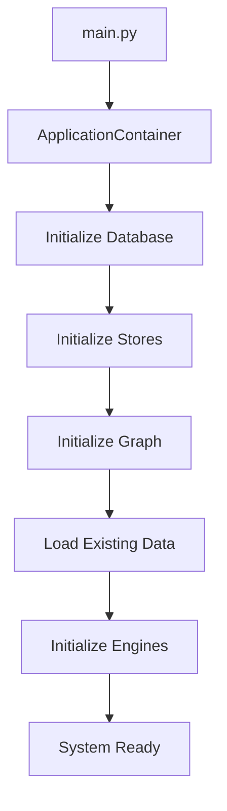

# Main Entry Point Documentation

## Overview

The `main.py` file serves as the primary entry point for the 3D Synaptic Neuron System. It provides a unified interface for running the system in different modes and manages the complete application lifecycle.

## Features

### 1. Dependency Injection Container

The `ApplicationContainer` class manages all system components and their dependencies:

- **Database Management**: SQLite database connection and schema
- **Storage Layer**: Neuron and synapse persistence
- **Neuron Graph**: Core 3D network structure with spatial indexing
- **Processing Engines**: Compression, query, and training engines
- **Configuration**: Centralized settings management

### 2. Lifecycle Management

The container handles proper initialization and shutdown:

```python
# Initialization order:
1. Database connection
2. Storage stores (neuron_store, synapse_store)
3. Neuron graph with spatial bounds
4. Load existing data from database
5. Initialize processing engines

# Shutdown order:
1. Save all pending changes
2. Close database connection
3. Cleanup resources
```

### 3. CLI Interface

The main entry point provides multiple commands for different use cases.

## Usage

### Starting the API Server

```bash
# Start with default settings (port 8000)
python main.py api

# Start on custom port
python main.py api --port 8080

# Start with auto-reload (development)
python main.py api --reload

# Start on specific host
python main.py api --host 127.0.0.1 --port 9000
```

### Interactive Shell

Launch an interactive Python shell with the system initialized:

```bash
python main.py shell
```

Available objects in the shell:
- `container`: Application container with all components
- `graph`: Neuron graph instance
- `query_engine`: Query engine for searching neurons
- `training_engine`: Training engine for modifying the network

Example shell session:
```python
>>> # Add a knowledge neuron
>>> from neuron_system.neuron_types.knowledge_neuron import KnowledgeNeuron
>>> from neuron_system.core.vector3d import Vector3D
>>> import numpy as np
>>> 
>>> neuron = KnowledgeNeuron(
...     position=Vector3D(0, 0, 0),
...     vector=np.random.randn(384),
...     source_data="Python is a programming language"
... )
>>> graph.add_neuron(neuron)
>>> 
>>> # Query the system
>>> results = query_engine.query("programming language", top_k=5)
>>> print(f"Found {len(results)} results")
```

### System Status

Check the current system status:

```bash
python main.py status
```

Output includes:
- Database path
- Number of neurons and synapses
- Spatial bounds configuration
- Embedding model information

### Health Check

Run a comprehensive health check:

```bash
python main.py health
```

Checks all system components and returns exit code 0 if healthy, 1 if unhealthy.

## Configuration

### Command-Line Options

Global options (available for all commands):

```bash
--config PATH          # Path to configuration file (future feature)
--database PATH        # Path to database file (default: neuron_system.db)
--log-level LEVEL      # Logging level: DEBUG, INFO, WARNING, ERROR, CRITICAL
```

### Environment-Based Configuration

You can customize settings programmatically:

```python
from neuron_system.config.settings import update_settings

update_settings(
    database_path="custom_db.db",
    spatial_bounds_min=(-200.0, -200.0, -200.0),
    spatial_bounds_max=(200.0, 200.0, 200.0),
    default_top_k=20
)
```

## Programmatic Usage

### Using the Application Container

```python
from main import ApplicationContainer, initialize_app, shutdown_app

# Initialize the application
initialize_app()

# Get the container
from main import get_app_container
container = get_app_container()

# Use components
results = container.query_engine.query("search text")
container.training_engine.adjust_neuron(neuron_id, new_vector)

# Cleanup
shutdown_app()
```

### Custom Initialization

```python
from main import ApplicationContainer
from neuron_system.config.settings import Settings

# Create custom settings
settings = Settings(
    database_path="my_custom.db",
    spatial_bounds_min=(-50, -50, -50),
    spatial_bounds_max=(50, 50, 50)
)

# Initialize with custom settings
container = ApplicationContainer(settings)
container.initialize()

# Use the system
# ...

# Cleanup
container.shutdown()
```

## Integration with Existing Code

The main entry point is designed to work seamlessly with existing code:

### Option 1: Use the API Server (Recommended)

```bash
# Start the API server
python main.py api

# Use the SDK to interact with it
from neuron_system.sdk.client import NeuronSystemClient

client = NeuronSystemClient(base_url="http://localhost:8000")
results = client.query("search text")
```

### Option 2: Direct Integration

```python
from main import initialize_app, get_app_container

# Initialize once at application startup
initialize_app()

# Get components as needed
container = get_app_container()
query_engine = container.query_engine
training_engine = container.training_engine

# Use throughout your application
results = query_engine.query("text")
```

### Option 3: Use run_api.py (Legacy)

The existing `run_api.py` script still works and provides a simpler way to just start the API:

```bash
python run_api.py
```

## Architecture

### Dependency Injection

The `ApplicationContainer` implements a simple dependency injection pattern:

```
ApplicationContainer
├── Settings (configuration)
├── DatabaseManager
│   └── SQLite connection
├── NeuronStore
│   └── depends on DatabaseManager
├── SynapseStore
│   └── depends on DatabaseManager
├── NeuronGraph
│   ├── depends on NeuronStore
│   ├── depends on SynapseStore
│   └── contains SpatialIndex
├── CompressionEngine
│   └── sentence-transformers model
├── QueryEngine
│   ├── depends on NeuronGraph
│   └── depends on CompressionEngine
└── TrainingEngine
    └── depends on NeuronGraph
```

### Initialization Flow



## Error Handling

The main entry point includes comprehensive error handling:

- **Initialization Errors**: Logged with full stack trace, application exits
- **Shutdown Errors**: Logged but don't prevent cleanup of other components
- **Component Errors**: Caught and reported during health checks

## Logging

All operations are logged with appropriate levels:

- **INFO**: Normal operations (startup, shutdown, data loading)
- **WARNING**: Non-critical issues (already initialized, etc.)
- **ERROR**: Failures that prevent operation
- **DEBUG**: Detailed information (use `--log-level DEBUG`)

## Best Practices

1. **Always cleanup**: Use `shutdown_app()` or `container.shutdown()` when done
2. **Single initialization**: Don't initialize multiple times in the same process
3. **Use health checks**: Run health checks before critical operations
4. **Monitor logs**: Check logs for warnings and errors
5. **Use the API**: For production, use the API server mode for better isolation

## Troubleshooting

### "Application not initialized" Error

```python
# Make sure to initialize first
initialize_app()
container = get_app_container()
```

### Database Lock Errors

```bash
# Make sure no other process is using the database
# Check for .db-wal and .db-shm files
```

### Import Errors

```bash
# Make sure you're in the project root directory
cd /path/to/neuron_system
python main.py api
```

### Port Already in Use

```bash
# Use a different port
python main.py api --port 8080
```

## Future Enhancements

Planned features for the main entry point:

- [ ] Configuration file support (YAML/JSON)
- [ ] Multiple database backend support
- [ ] Distributed mode (multiple nodes)
- [ ] Backup and restore commands
- [ ] Migration commands
- [ ] Performance profiling mode
- [ ] Batch import/export commands

## See Also

- [API Documentation](./api/README.md)
- [SDK Documentation](../neuron_system/sdk/README.md)
- [Configuration Guide](./CONFIGURATION.md)
- [Deployment Guide](./DEPLOYMENT.md)
